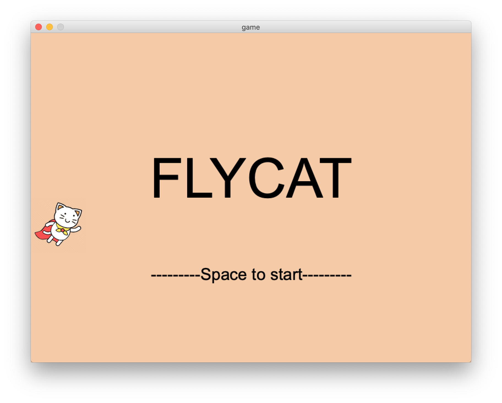
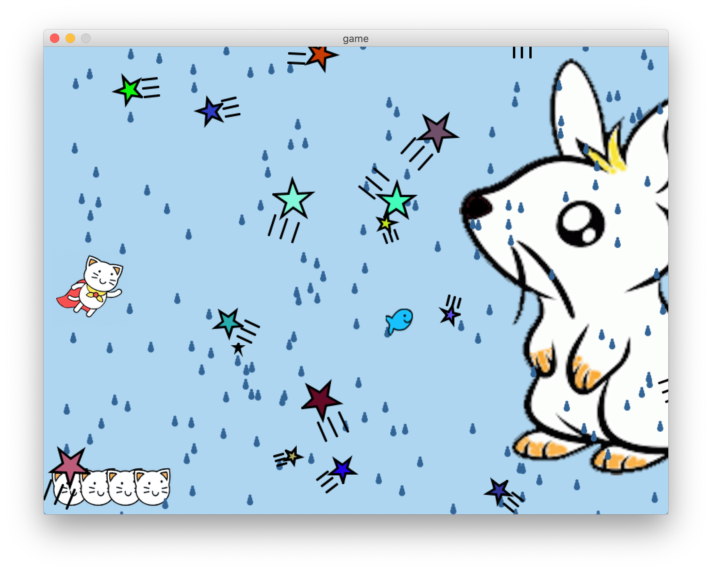
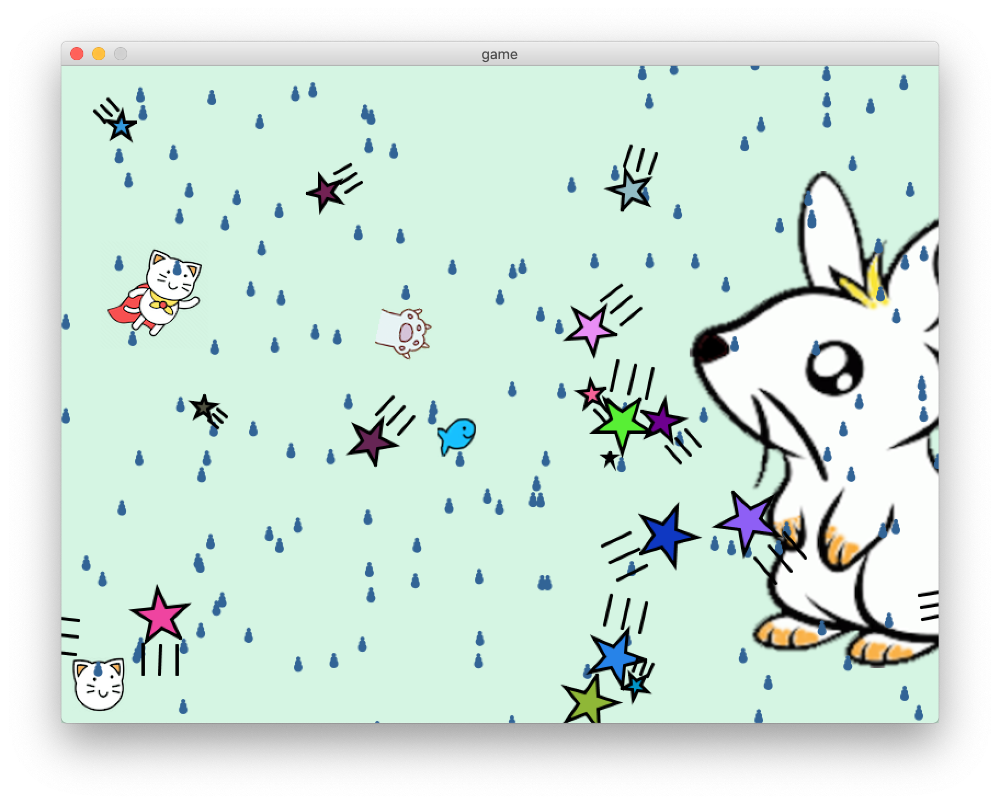
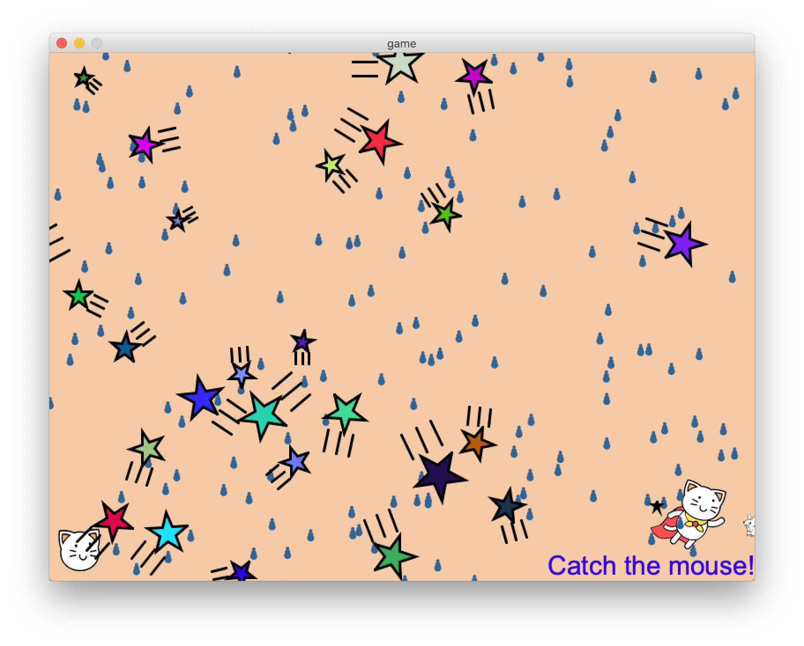
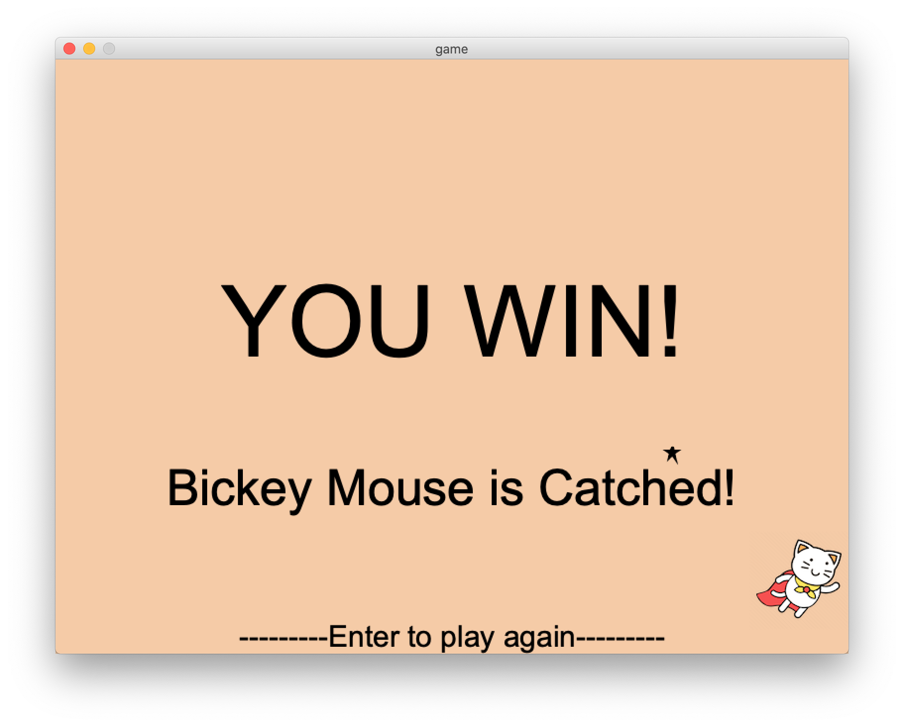
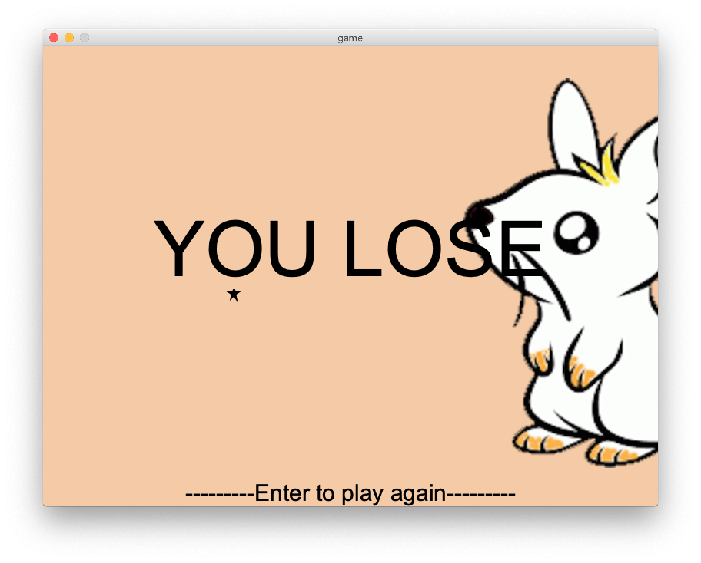

# FLYCAT

A game built by processing.

Move the "FLYCAT" to avoid the stars, and try to eat fishes as many as you can.
You can click the star to destory it.
Every fish you eat will become a cat claw to attack the Boss "Bickey Mouse".
"Bickey Mouse" is a huge mouse that you cannot catch it directly, but it will get smaller after hitting by a claw.
**Catch it after it becomes the smallest state!**

## Getting Started
Press "SPACE" key to start

## Interface
**The main game UI**

**Attack to the boss**

**Time to catch the mouse**

**Win**

**Lose**

## Built With
[Processing](https://github.com/processing/processing) - a flexible software sketchbook and a language for learning how to code within the context of the visual arts.

## Deployment
Tell me if you have some ideas to make it more interesting, or lighten the system.

## Author
codenew0

## License
The MIT License (MIT)
Copyright (c) 2020 codenew0
